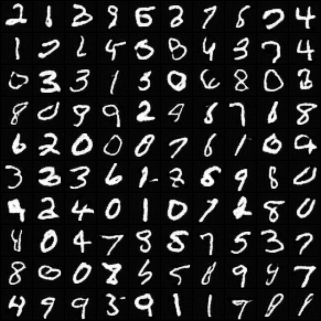
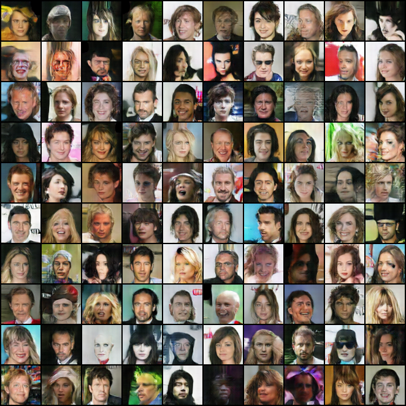

# Deep Convolutional Generative Adversarial Nets

> Deep Convolutional Generative Adversarial Nets   [[Paper Link](https://arxiv.org/pdf/1511.06434.pdf)]

**Pytorch implementation of Deep Convolutional Generative Adversarial Networks**

## MNIST
### Result

### Epoch 20

## FACE
### Result

### Epoch 170
